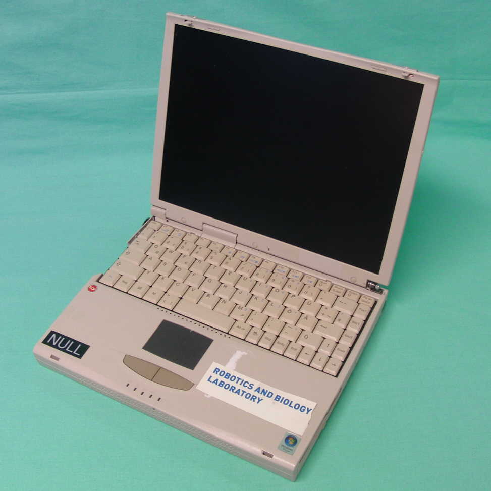

The RBO dataset of articulated objects and interactions is a collection of 358 RGB-D video sequences (67:18 minutes) of humans manipulating 14 articulated objects under varying conditions (light, perspective, background, interaction). All sequences are annotated with ground truth of the poses of the rigid parts and the kinematic state of the articulated object (joint states) obtained with a motion capture system. We also provide complete kinematic models of these objects (kinematic structure and three-dimensional textured shape models). In 78 sequences the contact wrenches during the manipulation are also provided.

## Data Structure and Usage

All data is availabe in two versions: as csv files and images or as [rosbags](http://wiki.ros.org/rosbag). Since there are already a lot of tools available for handling rosbags we recommend the later one. Both versions contain time series of:
* RGB images
* Depth images
* Marker positions
* Rigid body poses
* Articulated object poses and configurations
* Interaction wrenches

You can download the data following the links below. We also provide the script [rbo_downloader.py](./scripts/rbo_downloader.py) to simplify this process. You can define the downloading root folder (option `--output_dir`), the objects models and/or interaction sequences to download (options `--objects` and `--interactions` with arguments), if you prefer to download rosbags instead of raw sensor data (option `--ros`), and if the downloaded files should be automatically decompressed (option `--no_decomp`, default is auto-decomp). You can also download groups of interactions per property, e.g. `with_ft` for all interactions with force/torque (wrenches) measurements. To see the complete options, use the argument `-h`.

For example, `python rbo_downloader.py --output_dir ./mydatasetfolder --objects ikea globe --interactions dark` will download the models for the ikea furniture and the world globe and all the interactions with dark lighting conditions into the folder `mydatasetfolder`.

### Visualizing data in CSV files and images

We provide the script [rbo_visualizer.py](./scripts/rbo_visualizer.py) to visualize the data and show how to read it and use it. You can visualize the RGB, depth, force/torque (wrenches) and/or joint state values for an interaction. To use the script you just need to provide as argument the folder with the interaction files and the flags for the types of data to visualize (`--rgb`, `--d`, `--ft`, and/or `--js`). 

For example, `python rbo_visualizer.py ./mydatasetfolder/interactions/ikea/ikea01_0 --rgb --js` will start the visualization of the RGB images and joint states of the interaction in the provided folder. You can pause/resume the visualization pressing `Enter` in the terminal.

### Visualizing data in rosbags

We provide a [ROS package](./ros_package/ros_package_articulated_objects.tar.gz) to visualize rosbags and models. To visualize rosbags of interactions together with the models of the articulated object (and the stick with the force/torque sensor if used), execute:

`cd yourcatkinfolder/articulated-objects-db/`

`python launch/play_recording.py <interaction_name>`

the interaction_name is the name of the final rosbag (e.g. pliers01_o.bag) that you want to visualize. You can type `python launch/play_recording.py -h` to see additional help. It is also possible to play a recording without starting rviz, which allows the use of custom launch configurations, if required.

To make possible for the ROS package to locate the dataset, create a link to your downloaded data by executing the following within the folder of the ROS package: 'ln -s ~/folder_containing_rbo_dataset/ ./data'

## Contributing

We are glad to augment our dataset with new models of articulated objects and/or sensor data of interactions with them. We can generate models of articulated objects from trajectories of the links tracked by a motion capture system (or any other 6D pose tracker) if you provide:
* Shape models for each link
* Transformation between the origin of the shape models and the tracked frames
If your interaction data includes images, please provide also the pose of the camera wrt. the object.
If you provide interaction wrenches, provide also the dynamic properties (mass, center of Mass, inertia matrix) of tool between the force/torque sensor and the object and the pose of the sensor wrt. object. 

Please, contact Thomas Hoffmann (<thomas.hoffmann@tu-berlin.de>) to include your data into the dataset.

<!-- ## Citation -->

## Models of Articulated Objects

Object | Photo | Model
-------|-------|------
Book   |  | 
Cabinet   |  | 
Cardboard box   |  | 
Clamp   |  | 
Folding rule   |  | 
Globe   |  | 
Ikea   |  | 
Ikea small   |  | 
Laptop   |  | 
Microwave   |  | 
Pliers   |  | 
Rubik's cube   |  | 
Treasure box   |  |  
Tripod   |  | 

## Interactions

Interaction | Object | File | Duration [seconds]
-----------:|:------:|------|---------:
0 |  | book01_o.bag | 12.7
1 |  | book02_o.bag | 8.7
2 |  | book03_o.bag | 11.0
3 |  | book04_o.bag | 8.7
4 |  | book05_o.bag | 8.6
5 |  | book06_o.bag | 8.8
6 |  | book07_o.bag | 8.7
7 |  | book08_o.bag | 8.0
8 |  | book09_o.bag | 10.1
9 |  | book10_o.bag | 8.6
10 |  | book11_o.bag | 8.4
11 |  | book12_o.bag | 9.0
12 |  | book13_o.bag | 9.4
13 |  | book14_o.bag | 11.4
14 |  | book15_o.bag | 6.8
15 |  | book16_o.bag | 9.0
16 |  | book17_o.bag | 11.3
17 |  | book18_o.bag | 11.4
18 |  | book19_o.bag | 7.9
19 |  | book20_o.bag | 9.0
20 |  | book22_o.bag | 15.4
21 |  | book23_o.bag | 18.1
22 |  | book25_o.bag | 26.9
23 |  | book26_o.bag | 16.3
24 |  | book27_o.bag | 38.9
25 |  | cabinet01_o.bag | 15.1
26 |  | cabinet02_o.bag | 14.4
27 |  | cabinet03_o.bag | 8.2
28 |  | cabinet04_o.bag | 11.5
29 |  | cabinet05_o.bag | 13.3
30 |  | cabinet06_o.bag | 12.0
31 |  | cabinet07_o.bag | 11.9
32 |  | cabinet08_o.bag | 11.1
33 |  | cabinet09_o.bag | 19.8
34 |  | cabinet10_o.bag | 15.2
35 |  | cabinet11_o.bag | 11.7
36 |  | cabinet12_o.bag | 16.5
37 |  | cabinet13_o.bag | 9.6
38 |  | cabinet14_o.bag | 13.0
39 |  | cabinet15_o.bag | 15.7
40 |  | cabinet16_o.bag | 12.7
41 |  | cabinet17_o.bag | 12.8
42 |  | cabinet18_o.bag | 9.0
43 |  | cabinet19_o.bag | 10.5
44 |  | cabinet20_o.bag | 14.0
45 |  | cabinet21_o.bag | 12.6
46 |  | cabinet22_o.bag | 16.0
47 |  | cabinet23_o.bag | 16.6
48 |  | cabinet24_o.bag | 11.6
49 |  | cabinet25_o.bag | 14.2
50 |  | cabinet26_o.bag | 9.6
51 |  | cardboardbox01_o.bag | 13.7
52 |  | cardboardbox02_o.bag | 7.4
53 |  | cardboardbox03_o.bag | 8.9
54 |  | cardboardbox04_o.bag | 6.6
55 |  | cardboardbox05_o.bag | 8.4
56 |  | cardboardbox06_o.bag | 7.4
57 |  | cardboardbox07_o.bag | 6.8
58 |  | cardboardbox08_o.bag | 5.7
59 |  | cardboardbox09_o.bag | 6.6
60 |  | cardboardbox10_o.bag | 7.5
61 |  | cardboardbox11_o.bag | 9.2
62 |  | cardboardbox12_o.bag | 9.0
63 |  | cardboardbox13_o.bag | 6.9
64 |  | cardboardbox14_o.bag | 9.1
65 |  | cardboardbox15_o.bag | 7.5
66 |  | cardboardbox16_o.bag | 7.0
67 |  | cardboardbox17_o.bag | 7.7
68 |  | cardboardbox18_o.bag | 6.9
69 |  | cardboardbox19_o.bag | 7.7
70 |  | cardboardbox20_o.bag | 5.8
71 |  | cardboardbox21_o.bag | 7.9
72 |  | cardboardbox22_o.bag | 15.8
73 |  | cardboardbox23_o.bag | 12.5
74 |  | cardboardbox24_o.bag | 21.4
75 |  | cardboardbox25_o.bag | 15.1
76 |  | cardboardbox26_o.bag | 10.4
77 |  | clamp01_o.bag | 13.0
78 |  | clamp02_o.bag | 7.4
79 |  | clamp03_o.bag | 10.6
80 |  | clamp04_o.bag | 7.0
81 |  | clamp05_o.bag | 7.5
82 |  | clamp06_o.bag | 10.6
83 |  | clamp07_o.bag | 8.1
84 |  | clamp08_o.bag | 10.3
85 |  | clamp09_o.bag | 5.9
86 |  | clamp10_o.bag | 8.1
87 |  | clamp11_o.bag | 8.4
88 |  | clamp12_o.bag | 10.3
89 |  | clamp13_o.bag | 6.5
90 |  | clamp14_o.bag | 5.9
91 |  | clamp15_o.bag | 7.2
92 |  | clamp16_o.bag | 9.9
93 |  | clamp17_o.bag | 7.7
94 |  | clamp18_o.bag | 6.1
95 |  | clamp19_o.bag | 8.6
96 |  | clamp20_o.bag | 9.8
97 |  | clamp22_o.bag | 11.7
98 |  | clamp23_o.bag | 14.9
99 |  | clamp24_o.bag | 11.5
100 |  | clamp25_o.bag | 15.1
101 |  | clamp26_o.bag | 13.3
102 |  | clamp27_o.bag | 15.2
103 |  | foldingrule01_o.bag | 20.1
104 |  | foldingrule02_o.bag | 7.2
105 |  | foldingrule03_o.bag | 6.9
106 |  | foldingrule04_o.bag | 8.0
107 |  | foldingrule05_o.bag | 9.3
108 |  | foldingrule06_o.bag | 14.2
109 |  | foldingrule07_o.bag | 8.0
110 |  | foldingrule08_o.bag | 7.5
111 |  | foldingrule09_o.bag | 5.9
112 |  | foldingrule10_o.bag | 7.5
113 |  | foldingrule11_o.bag | 8.4
114 |  | foldingrule12_o.bag | 12.1
115 |  | foldingrule13_o.bag | 8.2
116 |  | foldingrule14_o.bag | 13.9
117 |  | foldingrule15_o.bag | 9.4
118 |  | foldingrule16_o.bag | 11.0
119 |  | foldingrule17_o.bag | 11.4
120 |  | foldingrule18_o.bag | 10.2
121 |  | foldingrule19_o.bag | 6.2
122 |  | foldingrule20_o.bag | 8.2
123 |  | foldingrule21_o.bag | 44.0
124 |  | foldingrule22_o.bag | 69.0
125 |  | foldingrule23_o.bag | 67.0
126 |  | foldingrule24_o.bag | 56.3
127 |  | foldingrule25_o.bag | 52.2
128 |  | foldingrule26_o.bag | 27.6
129 |  | globe01_o.bag | 9.5
130 |  | globe02_o.bag | 8.5
131 |  | globe03_o.bag | 8.5
132 |  | globe04_o.bag | 9.7
133 |  | globe05_o.bag | 6.5
134 |  | globe06_o.bag | 7.5
135 |  | globe07_o.bag | 8.3
136 |  | globe08_o.bag | 6.6
137 |  | globe09_o.bag | 10.0
138 |  | globe10_o.bag | 8.8
139 |  | globe11_o.bag | 8.5
140 |  | globe12_o.bag | 9.4
141 |  | globe13_o.bag | 9.4
142 |  | globe14_o.bag | 8.0
143 |  | globe15_o.bag | 7.9
144 |  | globe16_o.bag | 8.7
145 |  | globe17_o.bag | 8.6
146 |  | globe18_o.bag | 10.5
147 |  | globe19_o.bag | 8.6
148 |  | globe20_o.bag | 7.9
149 |  | globe21_o.bag | 19.0
150 |  | globe22_o.bag | 18.0
151 |  | globe23_o.bag | 23.0
152 |  | globe24_o.bag | 9.2
153 |  | globe25_o.bag | 14.1
154 |  | ikea01_o.bag | 19.6
155 |  | ikea02_o.bag | 7.4
156 |  | ikea03_o.bag | 12.3
157 |  | ikea04_o.bag | 7.7
158 |  | ikea05_o.bag | 8.3
159 |  | ikea06_o.bag | 11.0
160 |  | ikea07_o.bag | 8.2
161 |  | ikea08_o.bag | 2.7
162 |  | ikea09_o.bag | 3.0
163 |  | ikea10_o.bag | 5.9
164 |  | ikea11_o.bag | 6.0
165 |  | ikea12_o.bag | 9.8
166 |  | ikea13_o.bag | 6.6
167 |  | ikea14_o.bag | 5.4
168 |  | ikea15_o.bag | 5.0
169 |  | ikea16_o.bag | 6.2
170 |  | ikea17_o.bag | 7.4
171 |  | ikea18_o.bag | 7.5
172 |  | ikea19_o.bag | 9.0
173 |  | ikea20_o.bag | 7.2
174 |  | ikea22_o.bag | 16.0
175 |  | ikea23_o.bag | 14.8
176 |  | ikea24_o.bag | 13.2
177 |  | ikea25_o.bag | 24.2
178 |  | ikeasmall01_o.bag | 8.6
179 |  | ikeasmall02_o.bag | 9.5
180 |  | ikeasmall03_o.bag | 10.4
181 |  | ikeasmall04_o.bag | 12.0
182 |  | ikeasmall05_o.bag | 8.6
183 |  | ikeasmall06_o.bag | 9.1
184 |  | ikeasmall07_o.bag | 7.6
185 |  | ikeasmall08_o.bag | 9.1
186 |  | ikeasmall09_o.bag | 11.8
187 |  | ikeasmall10_o.bag | 16.3
188 |  | ikeasmall11_o.bag | 10.3
189 |  | ikeasmall12_o.bag | 9.4
190 |  | ikeasmall13_o.bag | 9.0
191 |  | ikeasmall14_o.bag | 8.3
192 |  | ikeasmall15_o.bag | 8.6
193 |  | ikeasmall16_o.bag | 11.6
194 |  | ikeasmall17_o.bag | 10.7
195 |  | ikeasmall18_o.bag | 8.1
196 |  | ikeasmall19_o.bag | 7.3
197 |  | ikeasmall20_o.bag | 13.5
198 |  | ikeasmall21_o.bag | 12.1
199 |  | ikeasmall22_o.bag | 10.1
200 |  | ikeasmall23_o.bag | 10.1
201 |  | ikeasmall24_o.bag | 9.8
202 |  | ikeasmall25_o.bag | 9.9
203 |  | laptop01_o.bag | 6.2
204 |  | laptop02_o.bag | 6.9
205 |  | laptop03_o.bag | 6.6
206 |  | laptop04_o.bag | 6.4
207 |  | laptop05_o.bag | 6.2
208 |  | laptop06_o.bag | 6.9
209 |  | laptop07_o.bag | 4.2
210 |  | laptop08_o.bag | 5.9
211 |  | laptop09_o.bag | 7.5
212 |  | laptop10_o.bag | 7.2
213 |  | laptop11_o.bag | 9.6
214 |  | laptop12_o.bag | 8.0
215 |  | laptop13_o.bag | 4.5
216 |  | laptop14_o.bag | 8.3
217 |  | laptop15_o.bag | 7.3
218 |  | laptop16_o.bag | 8.7
219 |  | laptop17_o.bag | 7.4
220 |  | laptop18_o.bag | 7.2
221 |  | laptop19_o.bag | 9.1
222 |  | laptop20_o.bag | 10.1
223 |  | laptop22_o.bag | 14.9
224 |  | laptop23_o.bag | 15.4
225 |  | laptop24_o.bag | 23.2
226 |  | laptop25_o.bag | 27.2
227 |  | laptop26_o.bag | 25.2
228 |  | microwave01_o.bag | 9.5
229 |  | microwave02_o.bag | 8.7
230 |  | microwave03_o.bag | 21.1
231 |  | microwave04_o.bag | 18.0
232 |  | microwave05_o.bag | 14.9
233 |  | microwave06_o.bag | 7.7
234 |  | microwave07_o.bag | 9.3
235 |  | microwave08_o.bag | 9.5
236 |  | microwave09_o.bag | 10.2
237 |  | microwave10_o.bag | 10.4
238 |  | microwave11_o.bag | 11.1
239 |  | microwave12_o.bag | 8.2
240 |  | microwave13_o.bag | 8.2
241 |  | microwave14_o.bag | 9.7
242 |  | microwave15_o.bag | 14.4
243 |  | microwave16_o.bag | 10.3
244 |  | microwave17_o.bag | 15.0
245 |  | microwave18_o.bag | 9.2
246 |  | microwave19_o.bag | 8.7
247 |  | microwave20_o.bag | 10.6
248 |  | microwave21_o.bag | 11.1
249 |  | microwave22_o.bag | 6.5
250 |  | microwave23_o.bag | 10.6
251 |  | microwave24_o.bag | 9.9
252 |  | microwave25_o.bag | 8.9
253 |  | pliers01_o.bag | 7.4
254 |  | pliers02_o.bag | 8.0
255 |  | pliers03_o.bag | 6.3
256 |  | pliers04_o.bag | 9.1
257 |  | pliers05_o.bag | 11.1
258 |  | pliers06_o.bag | 6.2
259 |  | pliers07_o.bag | 7.8
260 |  | pliers08_o.bag | 10.5
261 |  | pliers09_o.bag | 6.9
262 |  | pliers10_o.bag | 8.7
263 |  | pliers11_o.bag | 10.1
264 |  | pliers12_o.bag | 6.9
265 |  | pliers13_o.bag | 5.8
266 |  | pliers14_o.bag | 10.4
267 |  | pliers15_o.bag | 6.6
268 |  | pliers16_o.bag | 8.5
269 |  | pliers17_o.bag | 7.8
270 |  | pliers18_o.bag | 5.2
271 |  | pliers19_o.bag | 5.7
272 |  | pliers20_o.bag | 7.0
273 |  | pliers21_o.bag | 11.9
274 |  | pliers22_o.bag | 10.4
275 |  | pliers23_o.bag | 14.7
276 |  | pliers24_o.bag | 13.9
277 |  | pliers25_o.bag | 10.9
278 |  | pliers26_o.bag | 12.2
279 |  | rubikscube01_o.bag | 12.1
280 |  | rubikscube02_o.bag | 8.4
281 |  | rubikscube03_o.bag | 9.3
282 |  | rubikscube04_o.bag | 14.0
283 |  | rubikscube05_o.bag | 11.3
284 |  | rubikscube06_o.bag | 8.6
285 |  | rubikscube07_o.bag | 8.5
286 |  | rubikscube08_o.bag | 8.5
287 |  | rubikscube09_o.bag | 15.7
288 |  | rubikscube10_o.bag | 7.6
289 |  | rubikscube11_o.bag | 13.1
290 |  | rubikscube12_o.bag | 10.5
291 |  | rubikscube13_o.bag | 8.4
292 |  | rubikscube14_o.bag | 6.7
293 |  | rubikscube15_o.bag | 8.5
294 |  | rubikscube16_o.bag | 10.8
295 |  | rubikscube17_o.bag | 13.1
296 |  | rubikscube18_o.bag | 10.0
297 |  | rubikscube19_o.bag | 5.1
298 |  | rubikscube20_o.bag | 7.1
299 |  | rubikscube26_o.bag | 15.9
300 |  | rubikscube27_o.bag | 24.5
301 |  | rubikscube28_o.bag | 33.0
302 |  | rubikscube29_o.bag | 52.6
303 |  | rubikscube30_o.bag | 22.1
304 |  | rubikscube31_o.bag | 20.6
305 |  | rubikscube32_o.bag | 28.0
306 |  | treasurebox01_o.bag | 13.6
307 |  | treasurebox02_o.bag | 9.1
308 |  | treasurebox03_o.bag | 7.8
309 |  | treasurebox04_o.bag | 8.9
310 |  | treasurebox05_o.bag | 7.6
311 |  | treasurebox06_o.bag | 7.0
312 |  | treasurebox07_o.bag | 6.9
313 |  | treasurebox08_o.bag | 7.9
314 |  | treasurebox09_o.bag | 9.9
315 |  | treasurebox10_o.bag | 8.3
316 |  | treasurebox11_o.bag | 8.3
317 |  | treasurebox12_o.bag | 7.5
318 |  | treasurebox13_o.bag | 7.1
319 |  | treasurebox14_o.bag | 7.7
320 |  | treasurebox15_o.bag | 6.5
321 |  | treasurebox16_o.bag | 7.2
322 |  | treasurebox17_o.bag | 9.0
323 |  | treasurebox18_o.bag | 7.1
324 |  | treasurebox19_o.bag | 7.5
325 |  | treasurebox20_o.bag | 8.4
326 |  | treasurebox21_o.bag | 12.7
327 |  | treasurebox22_o.bag | 15.2
328 |  | treasurebox23_o.bag | 14.2
329 |  | treasurebox24_o.bag | 11.9
330 |  | treasurebox25_o.bag | 20.1
331 |  | treasurebox26_o.bag | 13.4
332 |  | tripod01_o.bag | 18.7
333 |  | tripod02_o.bag | 7.6
334 |  | tripod03_o.bag | 6.5
335 |  | tripod04_o.bag | 7.7
336 |  | tripod05_o.bag | 7.5
337 |  | tripod06_o.bag | 10.9
338 |  | tripod07_o.bag | 7.8
339 |  | tripod08_o.bag | 12.5
340 |  | tripod09_o.bag | 8.5
341 |  | tripod10_o.bag | 6.8
342 |  | tripod11_o.bag | 9.8
343 |  | tripod12_o.bag | 11.2
344 |  | tripod13_o.bag | 7.0
345 |  | tripod14_o.bag | 6.5
346 |  | tripod15_o.bag | 7.5
347 |  | tripod16_o.bag | 11.5
348 |  | tripod17_o.bag | 7.2
349 |  | tripod18_o.bag | 10.7
350 |  | tripod19_o.bag | 7.9
351 |  | tripod20_o.bag | 9.7
352 |  | tripod21_o.bag | 13.0
353 |  | tripod22_o.bag | 10.3
354 |  | tripod23_o.bag | 15.4
355 |  | tripod24_o.bag | 13.6
356 |  | tripod25_o.bag | 19.9
357 |  | tripod26_o.bag | 14.5
